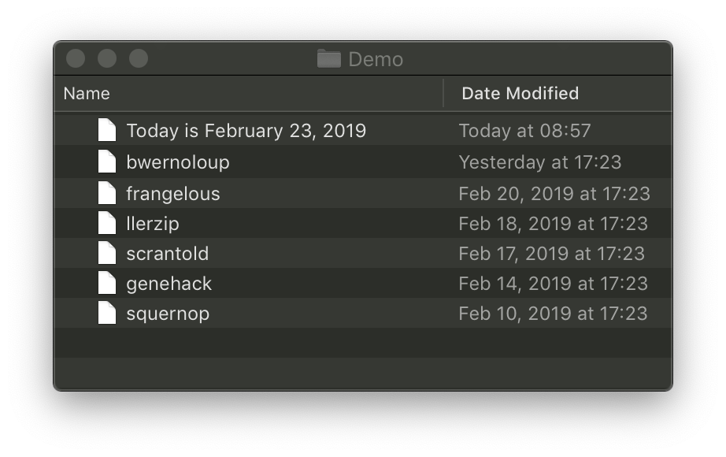
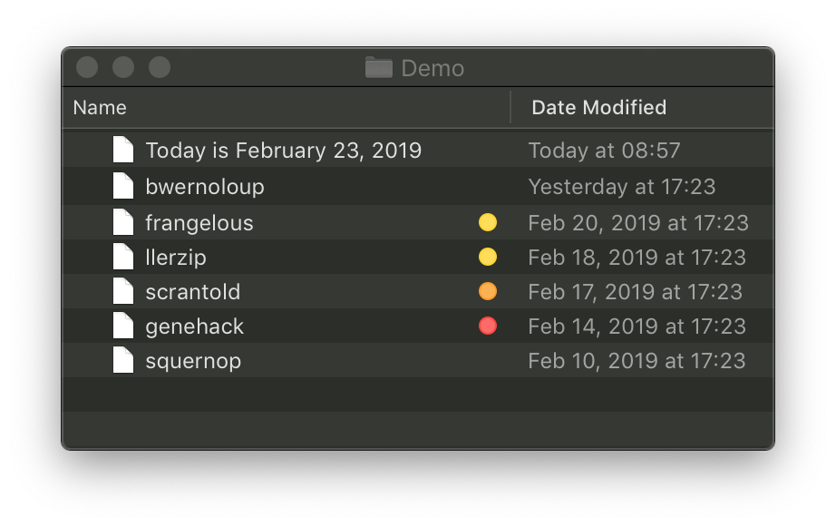

## Tide
### Let the Tide wash your cruft away

Tide is a commandline tool for macOS that changes the Finder color labels of files and folders in a specified directory as their last modification date gets further away. Ultimately, it deletes files and folders that reach a configured threshold of oldness.

I run it as an hourly cronjob to clean out old data in my downloads directory in the following manner:

```0	*	*	*	*	tide -c ~aaron/.tideconfig.json -dvp ~aaron/Downloads```

### Example
Let's say you have a directory of files like this:


If you were to run the command `tide -vc ~/.tideconfig.json -p .` (on February 23, 2019), you would see the following output:

```squernop: would delete
scrantold: marking orange
llerzip: marking yellow
genehack: marking red
frangelous: marking yellow```

And you would see this in the Finder:


Note that without the `-d` flag, tide doesn't delete anything.  
If you were to subsequently run the command `tide -dvc ~/.tideconfig.json -p .`, you would see the following output:

```squernop: deleting```

And this in the Finder:


### Configuration
Tide takes a configuration file as a mandatory parameter. This file specifies the durations of time at which the various colors or deletion happen to the items in the specified directory. If you pass the `-x` flag to Tide, it will emit an example configuration to stdout:

```{
	"yellow": "3d",
	"orange": "1w",
	"red"	: "10d",
	"delete": "2w"
}```

I personally use a config with a closer time horizon:

```{
	"yellow": "2d",
	"orange": "5d",
	"red"	: "1w",
	"delete": "10d"
}```

### Contributions
Contributions are welcome, provided that you acknowledge that this project is in the public domain, and that you relinquish any right of ownership to your contributions when you submit them.